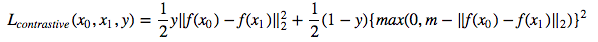
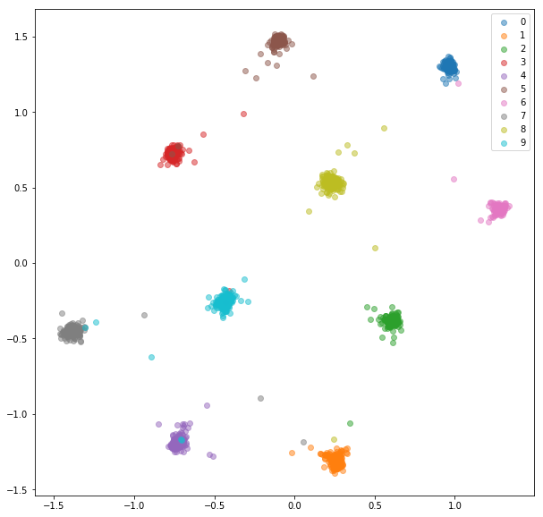
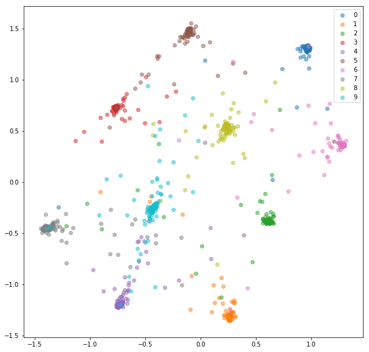
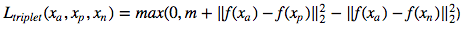
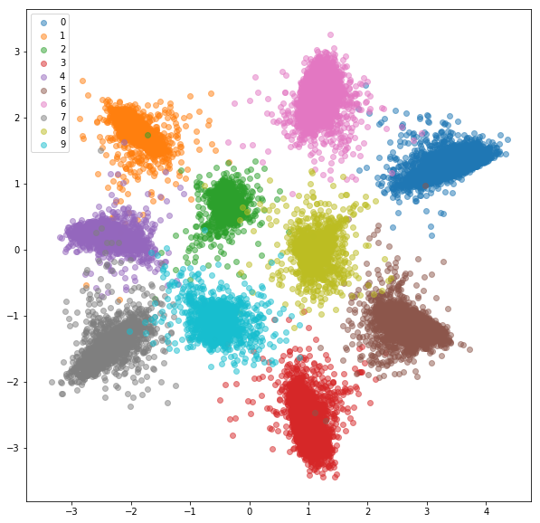
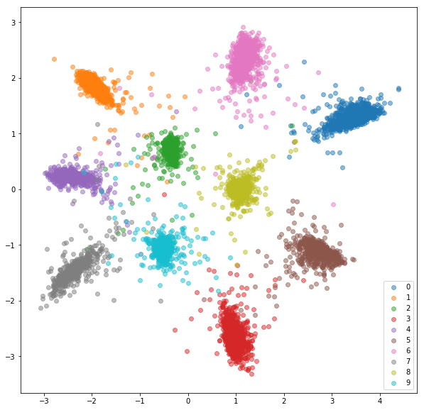

# Siamese and Triplet learning MNIST Dataset

PyTorch implementation of siamese and triplet networks for learning embeddings.

Siamese and triplet networks are useful to learn mappings from image to a compact Euclidean space where distances correspond to a measure of similarity [2]. Embeddings trained in such way can be used as features vectors for classification or few-shot learning tasks.

# Code structure

- **datasets.py**
  - *SiameseMNIST* class - wrapper for a MNIST-like dataset, returning random positive and negative pairs
  - *TripletMNIST* class - wrapper for a MNIST-like dataset, returning random triplets (anchor, positive and negative)
- **networks.py**
  - *EmbeddingNet* - base network for encoding images into embedding vector
  - *SiameseNet* - wrapper for an embedding network, processes pairs of inputs
  - *TripletNet* - wrapper for an embedding network, processes triplets of inputs
- **losses.py**
  - *ContrastiveLoss* - contrastive loss for pairs of embeddings and pair target (same/different)
  - *TripletLoss* - triplet loss for triplets of embeddings
- **trainer.py**
  - *fit* - unified function for training a network with different number of inputs and different types of loss functions

# Examples - MNIST

We'll train embeddings on MNIST dataset. Experiments were run in [jupyter notebook](Embedding_generation.ipynb).

## Siamese network

We train a siamese network that takes a pair of images and trains the embeddings so that the distance between them is minimized if they're from the same class and is greater than some margin value if they represent different classes.
We'll minimize a contrastive loss function:

*SiameseMNIST* class samples random positive and negative pairs that are then fed to Siamese Network.

After 20 epochs of training here are the embeddings we get for training set:

Test set:

## Triplet network

Secondly we train a triplet network, that takes an anchor, a positive (of same class as an anchor) and negative (of different class than an anchor) examples. The objective is to learn embeddings such that the anchor is closer to the positive example than it is to the negative example by some margin value.

**Triplet loss**:   

*TripletMNIST* class samples a positive and negative example for every possible anchor.

After 20 epochs of training here are the embeddings we get for training set:

Test set:

The learned embeddings are not as close to each other within class as in case of siamese network, but that's not what we optimized them for. We wanted the embeddings to be closer to other embeddings from the same class than from the other classes and we can see that's where the training is going to.

# TODO

- [ ] Optimize triplet selection
- [ ] Evaluate with a metric that is comparable between approaches
- [ ] Evaluate in one-shot setting when classes from test set are not in train set

